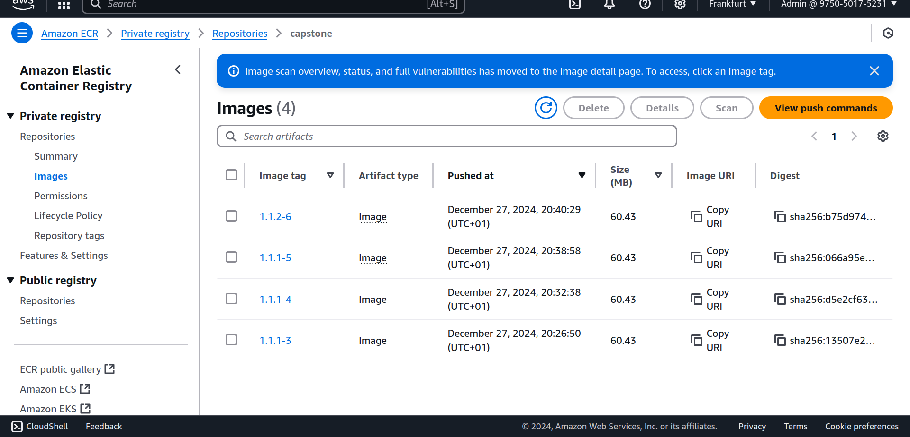
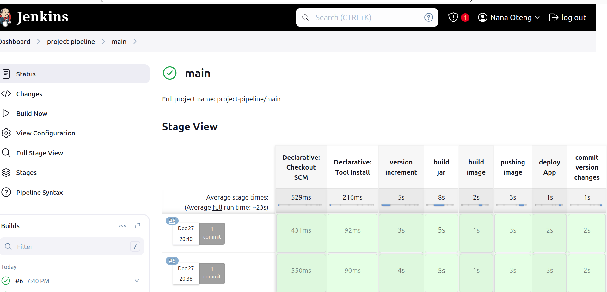

# Complete CI/CD pipeline with EKS and private Docker registry

## Prerequisites and Technologies used

- **DigitalOcean Account**: For provisioning the server.
- **AWS Account**: For setting up ECR and EKS.
- **AWS EKS**: Kubernetes cluster for scaling application.
- **Jenkins**: Installed as a container on the DigitalOcean server.
- **Docker**: For building and pushing images.
- **kubectl**: To interact with the Kubernetes cluster.
- **AWS ECR**: Private artifact registry for docker images.
- **Git**: For version control.

## Project Overview

Complete CI/CD pipeline project that dynamically increment application version, build artifact, build docker image and push to AWS ECR registry and deploy application to kubernetes cluster by pulling image from AWS ECR regisry with the pipeline stage below:

   **Pipeline Stages**:
   - **Dynamic Application Versioning**: Automatically increments the application version.
   - **Artifact Build**: Builds the Java Maven application artifact.
   - **Docker Image Build and Push**: Builds the Docker image and pushes it to the AWS ECR.
   - **Application Deployment**: Deploys the new application version to the EKS cluster using Kubernetes manifests.
   - **Version Commit**: Updates the application version in the Git repository.


## Motivation

The motivation for this project stems from the need to streamline application deployment processes in modern software development. By leveraging containerization, Kubernetes orchestration, and CI/CD pipelines, this project showcases:

- **Automation**: Minimizing manual intervention in deployment workflows.
- **Scalability**: Utilizing Kubernetes to scale applications based on demand.
- **Efficiency**: Reducing deployment times and ensuring consistent environments.
- **Reliability**: Integrating version control, artifact management, and container registries to enhance deployment robustness.


## Setup Instructions

### 1. Provision Server and Install Jenkins

- Create a server on DigitalOcean.
- ssh into the server and install docker on the server

    ssh root@138.68.108.14
    apt install docker.io
- Install Docker on the server.
- Run the Jenkins container:
  ```bash
   docker run -p 8080:8080 -p 50000:50000 -d -v jenkins_home:/var/jenkins_home jenkins/jenkins:lts
  ```
- Access Jenkins at `http://<server-ip>:8080`.

Enter the jenkins container to retrive the admin credentials of jenkins

    docker exec -it 32114f01d3e8  bash
Enter the publicIp  of server and port open for jenkins container in the browser

    cat /var/jenkins_home/secrets/initialAdminPassword

install docker inside jenkins container to be able to execute docker commands in jenkins
install envsubst inside jenkins to be able to subtitute environment variable in the yaml configuration files


### 2. Create eks cluster and ecr registry

- Create a private repository in AWS ECR:
  
- Jenkins and kubernetes need the credentials of ECR to be able to push and pull images to the registry. 

- to get the password of ECR registry:
  ```bash
  aws ecr get-login-password --region <region> | docker login --username AWS --password-stdin <account-id>.dkr.ecr.<region>.amazonaws.com
  ```

- EKS cluster is created using the eksctl command in the commandline.
  ```bash
  eksctl create cluster --name capstone --region eu-central-1 --node-type t2.micro --nodes 2
  ```
- To be able to deploy to Eks cluster from Jenkins, two plugins need to be installed inside jenkins container:
- Install kubectl inside jenkins container
   ```bash
  curl -LO https://storage.googleapis.com/kubernetes-release/release/$(curl -s https://storage.googleapis.com/kubernetes-release/release/stable.txt)/bin/linux/       amd64/kubectl; chmod +x ./kubectl; mv ./kubectl /usr/local/bin/kubectl
  ```
- install aws i am authenticator
  ```bash
      curl -Lo aws-iam-authenticator https://github.com/kubernetes-sigs/aws-iam-authenticator/releases/download/v0.6.11/aws-iam-authenticator_0.6.11_linux_amd64
      chmod +x ./aws-iam-authenticator
      mv ./aws-iam-authenticator /usr/local/bin
  ```
- Create .kube directory inside jenkins container in the home director "/var/jenkins_home/" and create a config file for kubernetes outside the container by substituting the cluster name , server endpoint and certificate authority data of the created cluster.
- copy the config file to the '/var/jenkins_home/.kube' directory
     ```bash
       docker cp config ip:/var/jenkins_home/.kube/
  ```

- Create credentials in kubernetes to authorize pulling image from the private registry
   ```bash
       kubectl create secret docker-registry aws_ecr_key docker-server="ecr endpoint" docker-username=AWS docker-password='add password'
  ```
 

#### Adjust jenkins pipeline with the stages below:
##### Stage1 : 
Version increment:  Application version in dynamically increased <br/>
##### Stage2: 
Package application <br/>
##### Stage3: 
build Application:  Docker image is built from the application with the dynamically increased version number and jenkins build number<br/>
##### Stage4:
Longin to ecr private docker registry and push the built image into the registry<br/>
##### Stage5:
Deploy application into kubernetes cluster: <br/>
Configuration files for deployment and service are created for the application and the imagePullPolicy is set to always pull image from the private registry. The ecr credentials created in the kubernetes cluster is defined in the configuration as the imagePullSecret.<br/>
##### Stage5:
commit changes back to the git repo with the updated version increment 



